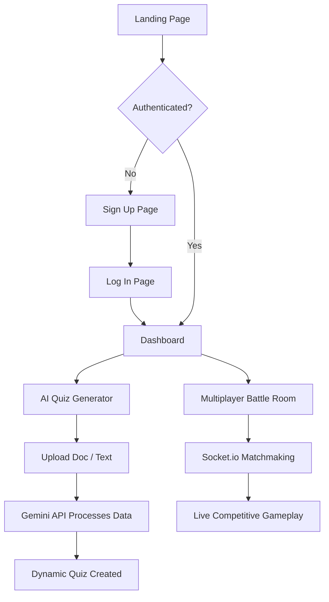

# AI Quiz Generator: Project Progress Report

## 1. Executive Summary
The **AI Quiz Generator** is a full-stack, AI-powered web application designed to revolutionize interactive learning and assessment. By leveraging advanced artificial intelligence (Google Gemini API), the platform allows users to dynamically generate quizzes from text or document uploads. Furthermore, it incorporates a real-time multiplayer "Battle Room" environment, turning standard quizzes into engaging, competitive gamified experiences.

---

## 2. System Architecture & Tech Stack
The project follows a robust, modern MERN-like stack architecture, heavily utilizing WebSockets for real-time interactions.

### 🌐 Frontend (Client-Side)
*   **Core Framework:** React + TypeScript (Bootstrapped with Vite for high performance).
*   **Routing:** React Router DOM for managing secure, sequential navigation flows.
*   **Styling:** Custom Vanilla CSS. We developed a bespoke "cyber-arena" aesthetic featuring translucent glassmorphism, dynamic gradients, and responsive micro-animations.
*   **Real-time Client:** `socket.io-client` for connecting to the multiplayer battle rooms.

### ⚙️ Backend (Server-Side)
*   **Server Environment:** Node.js with Express.js.
*   **Architecture:** MVC (Model-View-Controller) pattern, separating routes, controllers, and models for maintainability.
*   **Real-time Engine:** Socket.io for managing bi-directional communication, synchronized game states, and player matching.
*   **AI Integration:** Google Gemini API configured for natural language processing and automatic question generation.

### 🗄️ Database & Data Management
*   **Database:** MongoDB.
*   **ORM:** Mongoose for strict data schemas (Users, Quizzes, Game Sessions).

---

## 3. Key Milestones & Features Completed

### Phase 1: Foundation & Futuristic UI
*   **Cyber-Aesthetic Design System:** Implemented a unified design language across the application, avoiding generic UI libraries in favor of high-quality, custom-coded CSS.
*   **Dynamic UI Rendering:** Transitioned from static, hardcoded frontend elements to dynamically generated buttons and layouts that automatically adapt to the AI's quiz output.

### Phase 2: Security & Authentication Flow
*   **Sequential Onboarding:** Designed a strict user flow requiring account creation before granting access to the login portal.
*   **Session Management:** Implemented client-side authentication states (currently simulated via secure local storage for development) that dictate application behavior.
*   **Dynamic Navigation:** The navigation bar intelligently reacts to user state, replacing generic onboarding calls-to-action with secure "Log Out" options once a session is initialized.
*   **Password Visibility Controls:** Added modern UX quality-of-life features like secure password visibility toggles.

### Phase 3: The Multiplayer Battle Room
*   **WebSocket Infrastructure:** Set up the foundational Socket.io architecture on both the Node.js server and React client.
*   **Battle Room UI:** Designed the waiting rooms and active gameplay arenas where users will compete in real-time.

---

## 4. Application Flow Overview

---

## 5. Next Steps & Roadmap
1.  **Backend Auth Integration:** Transition the frontend's simulated authentication to fully communicate with the Node.js backend using JWTs (JSON Web Tokens) and bcrypt password hashing.
2.  **Live Gameplay Sync:** Finalize the Socket.io event listeners to broadcast live scores and timer syncs between opposing players in the Battle Room.
3.  **Deployment Prep:** Containerize or prep the client/server directories for cloud deployment (e.g., Vercel for Frontend, Render/Heroku for Backend).
